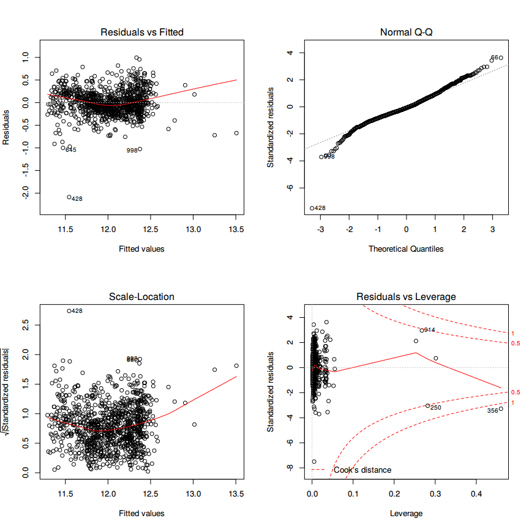

Exploratory Data Analysis
================

First, let us load the data and necessary packages:

``` r
load("ames_train.Rdata")
library(MASS)
library(BAS)
library(dplyr)
library(tidyr)
library(ggplot2)
library(ggthemes)
library(GGally)

A <- ames_train
```

Ages of the Houses
==================

Make a labeled histogram (with 30 bins) of the ages of the houses in the data set, and describe the distribution.

``` r
# overlay histogram and normal density

A <- A %>% mutate(Age=(2017 - Year.Built))  

mean_A <- mean(A$Age)
sd_A <- sd(A$Age)
  
ggplot(A, aes(x=Age)) +
    stat_bin(aes(y = ..density.., fill=..count..), bins = 30, binwidth=4.5) +
    stat_function(fun = dnorm, args = list(mean = mean_A, sd = sd_A), aes(color="Normal Distrib.")) + 
    geom_density(kernel="gaussian", aes(color = "Density Estimate")) + 
    geom_vline(aes(color = "Mean Age", xintercept = mean_A)) + 
    scale_colour_manual("Legend", 
            values =  c("Normal Distrib."="orangered2", "Density Estimate"="slateblue2", "Mean Age"="palegreen3")) +
    ggtitle("Histogram (with 30 bins) of the ages of the houses") + 
    scale_x_continuous(breaks=seq(0, 150, by=5))
```


The distribution of house ages is tri-modal. There are three peaks as seen by the density estimate. The youngest house is 7 years and the oldest is 145 years old, with a mean at 44.797 years. The three peaks correspond to (1) ~15 years the (2) at ~47 years and the last (3) at ~ 95 years of age.

The most houses have an age of &lt; 15 years, the economy is flourishing and the GDP is rising since the 2000's recession which explains the (1) peak. The early 1970's were a golden era of american capitalism, were middle class swelled as well as the GDP and productivity, that explains the (2) peak. The 1920's a.k.a "Roaring Twenties" were also a economical stable and strong time, which resulted in more house building which is visible in the (3) peak. In summary the distribution peaks are oriented towards the economical circumstances and not to a specific distribution.

The distribution does not assemble a normal distribution as clearly seen in the chart where the red line represents the normal distribution of this data with mean=44.797 and sd=29.6374116.

For the timespan that is examined here the distribution looks right skewed. Economy rises, people are getting wealthier and hence can build more houses.

100 years ago only a few people could afford to build a house an so there are not a lot houses recorded in that time.

Location, Location, Location
============================

The mantra in real estate is "Location, Location, Location!" Make a graphical display that relates a home price to its neighborhood in Ames, Iowa. Which summary statistics are most appropriate to use for determining the most expensive, least expensive, and most heterogeneous (having the most variation in housing price) neighborhoods? Report which neighborhoods these are based on the summary statistics of your choice. Report the value of your chosen summary statistics for these neighborhoods.

``` r
A <- ames_train

ggplot(A, aes(x=Neighborhood, y=price)) + 
    geom_boxplot() + 
    theme(axis.text.x = element_text(angle = 90, hjust = 1))
```


The plot reveals that there are three neighborhoods with high variation in house prices, namely Timber, StoneBr and NridgHt. Another thing to consider here is that there are a lot of outliers. Why? Because in every neighboorhood you will find more expensive and cheaper Houses than the average.

Two anwser the further question lets have a look a the distribution of the prices. This will anwser the question if one should use the mean of the median for further investigation.

``` r
ggplot(A, aes(x=price)) + 
    stat_bin(aes(y = ..density.., fill=..count..), bins=40) +
    stat_function(fun = dnorm, args = list(mean = mean(A$price), sd = sd(A$price)), aes(color="Normal Distrib.")) +
    geom_density(kernel="gaussian", aes(color = "Density Estimate")) +
    geom_vline(aes(color = "Mean Price", xintercept = mean(A$price))) + 
    scale_colour_manual("Legend", 
            values =  c("Normal Distrib."="orangered2", "Density Estimate"="slateblue2", "Mean Price"="palegreen3")) +
    ggtitle("Histogram (with 40 bins) of the price of the houses") 
```


Since the distributio is right skewed one is advices to use the median. The median is better suited for skewed distributions to derive at central tendency since it is much more robust and sensible.

``` r
median_A <- A %>% group_by(Neighborhood) %>% summarise(med=median(price))
max_A <- median_A[median_A$med == max(median_A$med),]
min_A <- median_A[median_A$med == min(median_A$med),]
var_A <- A %>% group_by(Neighborhood) %>% summarise(var=var(price)) %>% arrange(desc(var))
```

The most expensive neighborhood is StoneBr with a median price of \# A tibble: 1 x 1, med, <dbl>, 1 340691.5. The chepeast neighborhood is MeadowV with a median price of \# A tibble: 1 x 1, med, <dbl>, 1 85750. The neighboorhood with the highest variance is StoneBr with a variance of prices \# A tibble: 1 x 1, var, <dbl>, 1 15242150036.

Missing Values
==============

Which variable has the largest number of missing values? Explain why it makes sense that there are so many missing values for this variable.

``` r
A <- ames_train
isna <- colSums(is.na(A))
isna[match(max(colSums(is.na(A))), isna)]
```

    ## Pool.QC 
    ##     997

The variable with the larges number of missing values is =Pool.QC= which describes the quality of the pool. Having a look at the description of the variable to see what NA means, yields that a house with a Pool.QC == NA means there is no pool.

Since only a few people are wealthy enought to afford a pool, compared to the number of people living in the neighboorhood, it is comprehensible why there are so many NA's.

``` r
A <- ames_train

pools <- sum(!is.na(A$Pool.QC))

pool <- A %>% group_by(Neighborhood) %>% summarise(pool=sum(!is.na(Pool.QC))) 
nopool <- A %>% group_by(Neighborhood) %>% summarise(nopool=sum(is.na(Pool.QC))) 
med <- A %>% group_by(Neighborhood) %>% summarise(med=median(price))
rows <- A %>% group_by(Neighborhood) %>% summarise(n = n())

head(n = 10, cbind(med[,1:2], nopool[,2], pool[,2], rows[,2]) %>% arrange(desc(nopool)))
```

    ##    Neighborhood    med nopool pool   n
    ## 1         NAmes 139900    155    0 155
    ## 2       CollgCr 195800     85    0  85
    ## 3       Somerst 221650     74    0  74
    ## 4       OldTown 120000     71    0  71
    ## 5        Sawyer 136000     61    0  61
    ## 6       Edwards 127250     60    0  60
    ## 7       NridgHt 336860     56    1  57
    ## 8       Gilbert 183500     49    0  49
    ## 9       SawyerW 182500     46    0  46
    ## 10      Mitchel 156500     44    0  44

Among all neighboorhoods there are only 3 pools. The number of NA's is equal to the number of houses in the respective neighborhood. Additionally the pools are not located in the most expensive neighborhood.

Prediction of the home prices
=============================

We want to predict the natural log of the home prices. Candidate explanatory variables are lot size in square feet (Lot.Area), slope of property (Land.Slope), original construction date (Year.Built), remodel date (Year.Remod.Add), and the number of bedrooms above grade (Bedroom.AbvGr). Pick a model selection or model averaging method covered in the Specialization, and describe how this method works. Then, use this method to find the best multiple regression model for predicting the natural log of the home prices.

But first lets examine if there are highly correlated variables. Collinearity can change the coefficient estimates erratically in response to small changes in the model or the data.

``` r
A <- ames_train
B <- subset(A, select = c(price, Lot.Area, Land.Slope, Year.Built, Year.Remod.Add,Bedroom.AbvGr))
B <- B %>% mutate(price = log(price))
ggpairs(B, axisLabels = "none", mapping = ggplot2::aes(color = Land.Slope))
```

    ## `stat_bin()` using `bins = 30`. Pick better value with `binwidth`.
    ## `stat_bin()` using `bins = 30`. Pick better value with `binwidth`.
    ## `stat_bin()` using `bins = 30`. Pick better value with `binwidth`.
    ## `stat_bin()` using `bins = 30`. Pick better value with `binwidth`.
    ## `stat_bin()` using `bins = 30`. Pick better value with `binwidth`.


There are no collinear variables so one can proceed with the model selection process.

For the model selection the forward selection method will be used. Starting with an empty model one will add one predictor at a time until the parsimonious model is reached. A hybrid approach will be used depending on p-value and adjusted r squared. Lets start with =Lot.Area= and add a variable at a time.

``` r
M0 <- lm(price~Lot.Area, data=B)
M1 <- lm(price~Lot.Area + Land.Slope, data=B)
M2 <- lm(price~Lot.Area + Land.Slope + Year.Built, data=B)
M3 <- lm(price~Lot.Area + Land.Slope + Year.Built + Year.Remod.Add, data=B)
M4 <- lm(price~Lot.Area + Land.Slope + Year.Built + Year.Remod.Add + Bedroom.AbvGr, data=B)
M <- lm(price~., data=B)
```

    ## [1] "price~Lot.Area                                                            R^2:  0.0578611805020184"

    ## [1] "price~Lot.Area + Land.Slope                                               R^2:  0.0697254723466887"

    ## [1] "price~Lot.Area + Land.Slope + Year.Built                                  R^2:  0.460742085253642"

    ## [1] "price~Lot.Area + Land.Slope + Year.Built + Year.Remod.Add                 R^2:  0.531485946233459"

    ## [1] "price~Lot.Area + Land.Slope + Year.Built + Year.Remod.Add + Bedroom.AbvGr R^2:  0.559834474177341"

    ## [1] "price~.                                                                   R^2:  0.559834474177341"

Adding a variable at a time it is visible that R^2 is rising. Using all suggested variables into the model one has the highest R^2 value. Lets check our model with another approach and do the bayesian approach.

``` r
bas = bas.lm(price~.,
         data=B,
         prior="ZS-null", 
         modelprior=uniform(), initprobs="eplogp")
summary(bas)
```

    ##                P(B != 0 | Y)  model 1     model 2     model 3      model 4
    ## Intercept          1.0000000   1.0000   1.0000000   1.0000000   1.00000000
    ## Lot.Area           1.0000000   1.0000   1.0000000   1.0000000   1.00000000
    ## Land.SlopeMod      0.7200848   1.0000   0.0000000   1.0000000   0.00000000
    ## Land.SlopeSev      0.8465852   1.0000   1.0000000   0.0000000   0.00000000
    ## Year.Built         1.0000000   1.0000   1.0000000   1.0000000   1.00000000
    ## Year.Remod.Add     1.0000000   1.0000   1.0000000   1.0000000   1.00000000
    ## Bedroom.AbvGr      1.0000000   1.0000   1.0000000   1.0000000   1.00000000
    ## BF                        NA   1.0000   0.4240805   0.2112883   0.04677786
    ## PostProbs                 NA   0.5945   0.2521000   0.1256000   0.02780000
    ## R2                        NA   0.5625   0.5591000   0.5585000   0.55440000
    ## dim                       NA   7.0000   6.0000000   6.0000000   5.00000000
    ## logmarg                   NA 391.7282 390.8703770 390.1736773 388.66586363
    ##                     model 5
    ## Intercept      1.000000e+00
    ## Lot.Area       1.000000e+00
    ## Land.SlopeMod  0.000000e+00
    ## Land.SlopeSev  1.000000e+00
    ## Year.Built     1.000000e+00
    ## Year.Remod.Add 1.000000e+00
    ## Bedroom.AbvGr  0.000000e+00
    ## BF             8.073463e-13
    ## PostProbs      0.000000e+00
    ## R2             5.316000e-01
    ## dim            5.000000e+00
    ## logmarg        3.638832e+02

The summary shows that one should include every variable in the bayesian model selection. The resulting R^2 is about 0.5625.

Model diagnostics
=================

Which home has the largest squared residual in the previous analysis (Question 4)? Looking at all the variables in the data set, can you explain why this home stands out from the rest (what factors contribute to the high squared residual and why are those factors relevant)?

To see if there are outliers one should generate the standard diagnostic plots of the model.

``` r
par(mfrow=c(2,2))
plot(M)
```



``` r
ggnostic(M, mapping = ggplot2::aes(color = Lot.Area))
```

    ## Loading required package: broom

    ## Warning: Deprecated: please use `purrr::possibly()` instead

    ## Warning: Deprecated: please use `purrr::possibly()` instead

    ## Warning: Deprecated: please use `purrr::possibly()` instead

    ## Warning: Deprecated: please use `purrr::possibly()` instead

    ## Warning: Deprecated: please use `purrr::possibly()` instead

    ## `geom_smooth()` using method = 'gam'

    ## `geom_smooth()` using method = 'gam'
    ## `geom_smooth()` using method = 'gam'
    ## `geom_smooth()` using method = 'gam'

    ## Warning: Computation failed in `stat_smooth()`:
    ## x has insufficient unique values to support 10 knots: reduce k.


Looking at the 'Residuals vs. Fitted' and the 'Normal-Q-Q' plot it is evident that the home with index =428= has the highest squared residual 2.0878529.

Lets have a look at that home and how it compares to the others.

``` r
C <- B
mean_pr <- C %>% filter(Year.Built < 1930 & Year.Remod.Add < 1980)%>% summarise(mn=mean(price))
C[428,]$price <- mean_pr[[1]]

MC <- lm(price~., data=C)
max_resid <- max(abs(MC$residuals))
par(mfrow=c(2,2))
plot(MC)
```


``` r
ggnostic(MC, mapping = ggplot2::aes(color = Lot.Area))
```

    ## Warning: Deprecated: please use `purrr::possibly()` instead

    ## Warning: Deprecated: please use `purrr::possibly()` instead

    ## Warning: Deprecated: please use `purrr::possibly()` instead

    ## Warning: Deprecated: please use `purrr::possibly()` instead

    ## Warning: Deprecated: please use `purrr::possibly()` instead

    ## `geom_smooth()` using method = 'gam'
    ## `geom_smooth()` using method = 'gam'
    ## `geom_smooth()` using method = 'gam'
    ## `geom_smooth()` using method = 'gam'

    ## Warning: Computation failed in `stat_smooth()`:
    ## x has insufficient unique values to support 10 knots: reduce k.


Compared to the other houses the house with the highest residual has a significant lower price than the other compared houses. After testing each describing variable, where each describing variable was set to the corresponding mean of similar houses the residual was not reduced.

This means that the model is predicting a higher price for the features this house has. If the price is set to the mean of similar houses the examined house has no more the highest residual. The houses with new highest residual are 998 and 645 as seen in the 'Residuals vs. Fitted' plot.

There are still some leverage points as seen in the diagnostics plot (hat) and in the cooks distance plot for each explanatory variables.

The new highest squared residual 1.0217818 vs the old 2.0878529

Model Selection log(Lot.Area)
=============================

Use the same model selection method you chose in Question 4 to again find the best multiple regression model to predict the natural log of home prices, but this time **replacing Lot.Area with log(Lot.Area)**. Do you arrive at a model including the same set of predictors?

``` r
D <- B %>% mutate(Lot.Area = log(Lot.Area))
N0 <- lm(price~Lot.Area, data=D)
N1 <- lm(price~Lot.Area + Land.Slope, data=D)
N2 <- lm(price~Lot.Area + Land.Slope + Year.Built, data=D)
N3 <- lm(price~Lot.Area + Land.Slope + Year.Built + Year.Remod.Add, data=D)
N4 <- lm(price~Lot.Area + Land.Slope + Year.Built + Year.Remod.Add + Bedroom.AbvGr, data=D)
N <- lm(price~., data=D)
```

    ## [1] "price~Lot.Area                                                            R^2:  0.136851157667916"

    ## [1] "price~Lot.Area + Land.Slope                                               R^2:  0.138094288501603"

    ## [1] "price~Lot.Area + Land.Slope + Year.Built                                  R^2:  0.522505436075108"

    ## [1] "price~Lot.Area + Land.Slope + Year.Built + Year.Remod.Add                 R^2:  0.591088776010984"

    ## [1] "price~Lot.Area + Land.Slope + Year.Built + Year.Remod.Add + Bedroom.AbvGr R^2:  0.603201839590637"

    ## [1] "price~.                                                                   R^2:  0.603201839590637"

The model includes the same set of predictors but the resulting R^2 is now =0.60= compared to the previous =0.56=.

``` r
par(mfrow=c(2,2))
plot(N)
```


``` r
ggnostic(N)
```

    ## Warning: Deprecated: please use `purrr::possibly()` instead

    ## Warning: Deprecated: please use `purrr::possibly()` instead

    ## Warning: Deprecated: please use `purrr::possibly()` instead

    ## Warning: Deprecated: please use `purrr::possibly()` instead

    ## Warning: Deprecated: please use `purrr::possibly()` instead

    ## `geom_smooth()` using method = 'gam'
    ## `geom_smooth()` using method = 'gam'
    ## `geom_smooth()` using method = 'gam'
    ## `geom_smooth()` using method = 'gam'

    ## Warning: Computation failed in `stat_smooth()`:
    ## x has insufficient unique values to support 10 knots: reduce k.


Log Transform of Explanatory Variables
======================================

Do you think it is better to log transform Lot.Area, in terms of assumptions for linear regression? Make graphs of the predicted values of log home price versus the true values of log home price for the regression models selected for Lot.Area and log(Lot.Area). Referencing these two plots, provide a written support that includes a quantitative justification for your answer in the first part of question 7.

``` r
#B, M

BM <- data.frame(Observed = B$price, Predicted = fitted(M))

g0 <- ggplot(BM, aes(x=Predicted, y=Observed)) + geom_point() + stat_smooth(method = "lm", col = "red") +
    ggtitle("log(price) with Lot.Area") + geom_rug() + xlim(11, 13.5)


#D, N
DN <- data.frame(Observed = D$price, Predicted = fitted(N))

g1 <- ggplot(DN, aes(x=Predicted, y=Observed)) + geom_point() + stat_smooth(method = "lm", col = "red") +
        ggtitle("log(price) with log(Lot.Area)") + geom_rug()  + xlim(11, 13.5)

multiplot(g0, g1, cols = 2)
```

    ## Warning: Removed 1 rows containing non-finite values (stat_smooth).

    ## Warning: Removed 1 rows containing missing values (geom_point).


Ideally all of the points should be close to the regression line. Both models have a similiar R^2 which means that the points are spread the same around the regression line for each of the models. The lower the R^2, the weaker the goodnes of fit of the model. The points would be more foggy, dispersed away from the regression line.

Since the second model has a higher R^2 the points are more towards the regression line then in the first.

With the log transformation of Lot.Area the points are more evenly distributed along the regression line. If a clear pattern or trend can be detected, then the model has room for improvement.
